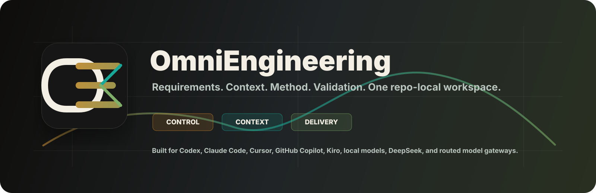
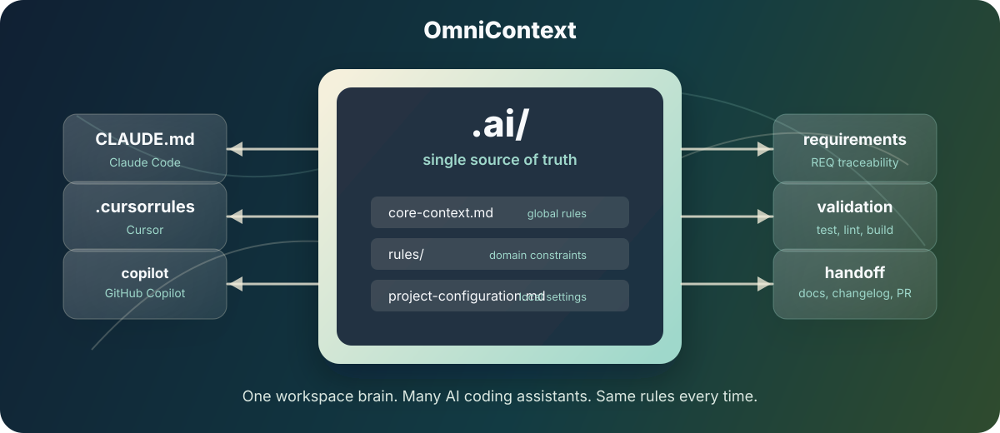

# OmniEngineering Workspace



[](https://www.python.org/)
[](LICENSE)
[](AGENTS.md)
[](CLAUDE.md)
[](.cursorrules)
[](.github/copilot-instructions.md)
[](.kiro/steering/omnicontext.md)
[](.ai/)

| Runtime | Assistants | Model Routes | Governance |
| --- | --- | --- | --- |
| Python 3.10+ | Codex, Claude Code, Cursor, GitHub Copilot, Kiro | Local models, DeepSeek workflows, OpenRouter-style gateways | Requirements, rulepacks, playbooks, checklists, SWEBOK knowledge |

OmniEngineering is a repo-local software engineering workspace for human and AI
engineering teams. Its goal is bigger than prompt sharing: it gives a project a
durable way to carry requirements, engineering rules, delivery workflows,
quality gates, design knowledge, and assistant context together.

OmniContext is the context-governance layer inside this workspace. Its job is to
prevent AI context drift when a team uses more than one assistant or model in
the same repository. Codex, Claude Code, Cursor, GitHub Copilot, Kiro-style
tools, local models, DeepSeek-based workflows, model routers, and future tools
can all read different entry files or prompts, but OmniContext routes them to
one shared `.ai/` source of truth.

The result is one practical engineering operating model: project rules,
architecture guidelines, security boundaries, requirement IDs, validation
expectations, SWEBOK-aligned knowledge, playbooks, checklists, handoff rules,
and completion workflows across every assistant.



## Design Documents

The project design source lives in `design/`. It includes product design,
system architecture, data model, assistant workflow, CLI behavior, validation
and operations, decision records, and supporting diagrams.

Start with:

- [Design overview](design/README.md)
- [System architecture](design/system-architecture.md)
- [Context routing diagram](design/diagrams/context-routing.svg)
- [Assistant lifecycle diagram](design/diagrams/assistant-lifecycle.svg)
- [Data model diagram](design/diagrams/data-model.svg)

## The Problem

Modern software teams rarely use only one AI assistant.

Codex may read `AGENTS.md`, Cursor may read `.cursorrules`, Claude Code may
read `CLAUDE.md`, and GitHub Copilot may read
`.github/copilot-instructions.md`. If each file contains a different version of
the project instructions, assistant behavior drifts.

Local models, hosted chat models, model-router gateways, and model APIs may not
read any repository entrypoint automatically. For those tools, OmniContext
provides `LLM_CONTEXT.md`, `.ai/context-manifest.json`, and copy-paste adapter
prompts in `.ai/adapters/`.

OmniContext solves that drift by making the root assistant files lightweight
routing shims. They point to `.ai/entrypoints/`, which points back to the
shared `.ai/` engineering workspace.

The unique case this solves is not prompt storage. It is governance for
AI-assisted development across multiple tools:

- One assistant should not skip requirement IDs while another uses them.
- One assistant should not update code without the changelog rule another tool
  follows.
- One assistant should not ignore security boundaries because it reads a
  different config file.
- One assistant should not claim completion without the validation workflow the
  rest of the team expects.

OmniEngineering gives the repository a shared engineering operating model
without locking the team into one vendor or editor.

## The Pattern

```text
[project-root]/
├── .ai/
│   ├── core-context.md
│   ├── project-configuration.md
│   ├── .ignore
│   ├── context-manifest.json
│   ├── project-map.md
│   ├── entrypoints/
│   │   ├── universal.md
│   │   ├── codex.md
│   │   ├── claude.md
│   │   ├── cursor.md
│   │   ├── copilot.md
│   │   ├── kiro.md
│   │   └── fallback-contract.md
│   ├── adapters/
│   │   ├── generic-llm.md
│   │   ├── local-model.md
│   │   ├── model-router.md
│   │   ├── openrouter.md
│   │   ├── deepseek.md
│   │   └── kiro.md
│   ├── playbooks/
│   │   ├── planning.md
│   │   ├── implementation.md
│   │   ├── review.md
│   │   ├── testing.md
│   │   ├── debugging.md
│   │   ├── refactoring.md
│   │   ├── migration.md
│   │   ├── release.md
│   │   └── handoff.md
│   ├── checklists/
│   │   ├── pre-implementation.md
│   │   ├── pre-completion.md
│   │   ├── public-release.md
│   │   └── security.md
│   ├── knowledge/
│   │   └── swebok/
│   │       ├── software-requirements.md
│   │       ├── software-design.md
│   │       ├── software-construction.md
│   │       ├── software-testing.md
│   │       ├── software-maintenance.md
│   │       ├── software-configuration-management.md
│   │       ├── software-engineering-management.md
│   │       ├── software-engineering-process.md
│   │       ├── software-engineering-models-and-methods.md
│   │       ├── software-quality.md
│   │       ├── software-engineering-professional-practice.md
│   │       ├── software-engineering-economics.md
│   │       ├── computing-foundations.md
│   │       ├── mathematical-foundations.md
│   │       ├── engineering-foundations.md
│   │       ├── requirements-quality-checklist.md
│   │       ├── design-quality-checklist.md
│   │       ├── construction-quality-checklist.md
│   │       ├── testing-quality-checklist.md
│   │       ├── maintenance-impact-checklist.md
│   │       ├── scm-checklist.md
│   │       ├── engineering-management-checklist.md
│   │       ├── process-tailoring-checklist.md
│   │       ├── model-method-selection-checklist.md
│   │       ├── quality-attribute-checklist.md
│   │       ├── professional-practice-checklist.md
│   │       ├── economics-decision-checklist.md
│   │       ├── computing-foundations-checklist.md
│   │       ├── mathematical-reasoning-checklist.md
│   │       ├── engineering-foundations-checklist.md
│   │       ├── srs-template.md
│   │       ├── design-brief-template.md
│   │       ├── test-plan-template.md
│   │       ├── maintenance-plan-template.md
│   │       ├── engineering-plan-template.md
│   │       ├── process-improvement-template.md
│   │       ├── quality-plan-template.md
│   │       └── tradeoff-analysis-template.md
│   ├── requirements/
│   │   └── requirements.json
│   ├── rules/
│   │   ├── universal-engineering-ruleset.json
│   │   ├── controlled-implementation.json
│   │   ├── completion-workflow.json
│   │   ├── data-governance.json
│   │   ├── fallback-llm-rules.json
│   │   ├── hci-ui-rules.json
│   │   └── oop-design.json
│   └── schemas/
│       ├── rulepack.schema.json
│       ├── requirements.schema.json
│       └── universal-engineering-ruleset.schema.json
│
├── LLM_CONTEXT.md
├── AGENTS.md
├── CLAUDE.md
├── .cursorrules
├── .kiro/
│   └── steering/
│       └── omnicontext.md
├── .github/
│   └── copilot-instructions.md
├── CHANGELOG.md
├── omni
├── pyproject.toml
└── make_ai.py
```

The `.ai/` directory is the master context directory. Root files are thin
compatibility shims for tools that require fixed filenames; the full
tool-specific instructions live in `.ai/entrypoints/`.

| Tool | Required shim | Full source |
| --- | --- | --- |
| Universal LLMs | `LLM_CONTEXT.md` | `.ai/entrypoints/universal.md` |
| Codex | `AGENTS.md` | `.ai/entrypoints/codex.md` |
| Claude Code | `CLAUDE.md` | `.ai/entrypoints/claude.md` |
| Cursor | `.cursorrules` | `.ai/entrypoints/cursor.md` |
| GitHub Copilot | `.github/copilot-instructions.md` | `.ai/entrypoints/copilot.md` |
| Kiro-style workflows | `.kiro/steering/omnicontext.md` | `.ai/entrypoints/kiro.md` |
| DeepSeek or local model wrappers | none | `.ai/adapters/deepseek.md`, `.ai/adapters/local-model.md` |
| OpenRouter or model gateways | none | `.ai/adapters/openrouter.md`, `.ai/adapters/model-router.md` |

## What This Workspace Enforces

This implementation goes beyond prompt sharing and context drift prevention. It
includes a strict file-based engineering workflow that can be reused across
projects without an MCP server:

- Targeted file access before any implementation work.
- Requirement IDs for every task and code change.
- Planning, implementation, review, testing, debugging, refactoring, migration,
  release, and handoff playbooks.
- Pre-implementation, pre-completion, public release, and security checklists.
- SWEBOK-aligned software requirements, design, construction, testing,
  maintenance, configuration management, engineering management, process,
  models and methods, quality, professional practice, economics, computing
  foundations, mathematical foundations, and engineering foundations guidance
  with quality checklists and lightweight templates.
- Small, isolated changes instead of broad rewrites.
- Modular, maintainable design standards.
- Security guardrails for secrets and sensitive files.
- Documentation and changelog updates as completion gates.
- Test, lint, typecheck, and build validation before claiming completion.
- Required final reporting with commit and pull request information.
- A requirement registry for tracking `REQ-###` work across assistants.
- A dependency-free doctor command for detecting workspace drift.
- A centralized fallback contract in `.ai/entrypoints/fallback-contract.md` in
  case an LLM skips the primary `.ai/` configuration.

The controlling global ruleset is:

```text
.ai/rules/universal-engineering-ruleset.json
```

Enforceable companion rules live beside it as structured JSON rulepacks in
`.ai/rules/`. The JSON format gives each rule a stable ID, severity, scope, and
validation hints so tools can inspect more than file existence.

## Context And Model Discipline

OmniEngineering is designed to reduce token waste and context drift.

- **Control the context window:** Keep `.ai/.ignore`, `.cursorignore`,
  `.gitignore`, and equivalent tool ignore files aggressive. Exclude logs,
  compiled artifacts, local environment files, dependency folders, generated
  output, caches, and large binaries.
- **Use the generated project map:** Run `./omni map` after adopting the
  workspace or changing project structure. Assistants should read
  `.ai/project-map.md` before broad traversal, then inspect only the smallest
  relevant path set.
- **Attach context manually:** Prefer attaching or naming the exact files and
  folders needed for the current requirement instead of allowing automatic
  whole-workspace scans.
- **Reset stale history:** Start a new session or compact the current one when
  switching tasks so old conversation history does not consume tokens or steer
  unrelated work.
- **Prompt specifically:** Include the requirement ID, framework, language,
  relevant patterns, constraints, and desired outcome in the first prompt when
  known.
- **Ask for outlines first:** For broad or risky work, ask for a plan or
  pseudo-code outline before generating or applying a large patch.
- **Cascade models:** Use cheaper or lower-effort models for boilerplate,
  formatting, simple docs, and mechanical edits. Save flagship or high-effort
  models for architecture, complex debugging, migrations, security-sensitive
  work, and high-risk design decisions.

## If You Clone a Repo That Already Uses This Workspace

You do not need to run `make_ai.py` just to benefit from the workspace.

If the repository already contains `.ai/`, `AGENTS.md`, `CLAUDE.md`,
`.cursorrules`, `.github/copilot-instructions.md`, `LLM_CONTEXT.md`, and
`.ai/context-manifest.json`, the workspace is already usable. Open the repo in
your assistant of choice and the shim files should route that assistant to the
matching source file in `.ai/entrypoints/`.

For a local model, DeepSeek chat/API wrapper, OpenRouter-style model gateway, or
any tool that does not read repository files automatically, paste the relevant
prompt from `.ai/adapters/` into the model's system, developer, or project
instruction field.

For model routers, include the adapter prompt in each new routed session. The
router can switch model slugs or providers, so context should be treated as part
of the request payload.

Use `make_ai.py` or `./omni` when you want to verify, sync, or adapt the
engineering workspace inside that repository:

- Run `./omni doctor` to check whether the workspace is healthy.
- Run `./omni sync` after editing entrypoint routing, fallback behavior, or
  assistant source content.
- Run `./omni validate` as an alias for `doctor`.

In other words: `.ai/` is the delivery workspace. `make_ai.py` and `omni` are
maintenance tools for checking and synchronizing it.

## Add The Workspace To A Project

Do not recreate the directory tree by hand. Bring the workspace files into the
target repository, then configure them for that project.

Use one of these adoption paths:

| Path | Best For | What To Do |
| --- | --- | --- |
| Template copy | New repositories | Create the project from an OmniEngineering template or copy this repository, then replace project-specific placeholders. |
| Drop-in copy | Existing repositories | Copy `.ai/` and only the needed tool shims into the target repo root, review conflicts, then run `./omni doctor`. |
| Vendored source | Teams that want upstream updates | Add OmniEngineering as a tracked subtree, submodule, or vendor directory, then copy or safely sync the root shims into the project. |
| Internal baseline | Organizations | Keep an approved internal fork and periodically merge upstream OmniEngineering improvements. |

For a normal existing repository, copy `.ai/` into the target repo root first:

```text
.ai/
```

Then add only the shims for tools the team actually uses:

```text
LLM_CONTEXT.md
AGENTS.md
CLAUDE.md
.cursorrules
.cursorignore
.github/copilot-instructions.md
.kiro/steering/omnicontext.md
```

Add the maintenance CLI if the project wants local validation and map commands:

```text
omni
make_ai.py
```

Do not overwrite an existing `pyproject.toml`. The installable `omni` console
script is optional; the repo-local `./omni` command is enough for validation.

If the target already has `AGENTS.md`, `CLAUDE.md`, `.cursorrules`,
`.cursorignore`, `.github/copilot-instructions.md`, `.kiro/`, `omni`, or
`make_ai.py`, merge manually instead of replacing the file. `./omni sync` will
skip existing non-Omni files by default. Use `./omni sync --force` only when
replacement is intentional.

Optional presentation assets:

```text
assets/identity/
assets/banners/
assets/omni-context.svg
design/
```

Keep the OmniEngineering license files when you distribute copied or modified
OmniEngineering workspace files:

```text
LICENSE
NOTICE
TRADEMARKS.md
CONTRIBUTING.md
LICENSES/
```

Then add or keep the target project's own license for its application code,
product code, docs, and data.

After copying, run:

```bash
./omni doctor
./omni map
```

If you edited fallback text or assistant entrypoints while adapting the
workspace, run:

```bash
./omni sync
./omni map
./omni doctor
```

`./omni sync` is collision-safe by default: it skips existing non-Omni files
instead of overwriting project-owned assistant configuration. Use
`./omni sync --force` only when replacement is intentional.

The root assistant files are already written as shims for Codex, Claude Code,
Cursor, GitHub Copilot, Kiro-style workflows, and generic/local/model-router
workflows. Edit `.ai/entrypoints/` for tool-specific behavior, then run
`./omni sync`.

## Configure a Project

Before using the workspace on a real project, fill in:

```text
.ai/project-configuration.md
```

At minimum, define:

- Project name.
- Repository type.
- Primary language or stack.
- Package manager.
- Build command.
- Test command.
- Lint command.
- Typecheck command.
- Changelog location.
- Documentation locations.
- Branching or pull request standard.
- Comment style.

Then customize:

```text
.ai/rules/universal-engineering-ruleset.json
```

Replace the angle-bracket placeholders with project-specific values and add
project requirements using the included `REQ-###` template.

## Daily Use

Once the workspace is initialized, keep the root assistant files boring. Most
changes should happen inside `.ai/`.

| Need | Edit |
| --- | --- |
| Global assistant behavior | `.ai/core-context.md` |
| Project commands and placeholders | `.ai/project-configuration.md` |
| Portable model loading order | `.ai/context-manifest.json` |
| Generated project structure map | `.ai/project-map.md` |
| Tool-specific entrypoint sources | `.ai/entrypoints/` |
| Local, DeepSeek, or generic model prompts | `.ai/adapters/` |
| OpenRouter or model-gateway prompts | `.ai/adapters/openrouter.md`, `.ai/adapters/model-router.md` |
| Task execution guidance | `.ai/playbooks/` |
| Completion gates | `.ai/checklists/` |
| Body-of-knowledge guidance | `.ai/knowledge/` |
| Strict operating rules | `.ai/rules/universal-engineering-ruleset.json` |
| Requirement registry | `.ai/requirements/requirements.json` |
| Machine-readable contracts | `.ai/schemas/` |
| Implementation workflow | `.ai/rules/controlled-implementation.json` |
| Completion and reporting workflow | `.ai/rules/completion-workflow.json` |
| Data contracts and transformations | `.ai/rules/data-governance.json` |
| Fallback assistant behavior | `.ai/entrypoints/fallback-contract.md`, `.ai/rules/fallback-llm-rules.json` |
| Security exclusions | `.ai/.ignore` |
| Change history | `CHANGELOG.md` |

Example prompt:

```text
Implement REQ-014. Use the minimum access scope from the requirement and follow
the completion workflow in .ai/rules/completion-workflow.json.
```

## Maintenance CLI

`omni` is a small dependency-free maintenance helper. It is not required for
normal day-to-day AI usage after the files are already present in a repo, but it
is the easiest way to confirm a drop-in copy is healthy. It requires Python 3.10
or newer.

Use it when you first bring the workspace into a project, change engineering
workspace configuration, edit assistant entrypoints, add rulepacks, or prepare a
public release.

Run it directly from the repository:

```bash
./omni doctor
./omni sync
./omni map
```

`./omni sync` updates generated Omni files and skips existing non-Omni files.
Use `./omni sync --force` only after manually deciding replacement is safe.

Or install the command once from the repository root:

```bash
python3 -m pip install -e .
```

After that, use:

```bash
omni doctor
omni sync
omni validate
omni map
```

`sync` verifies that the required `.ai/` source-of-truth files exist, then
refreshes `.ai/entrypoints/`, the root shim files, and synced ignore files.

It does not overwrite the `.ai/` rules. The rules are the source of truth.

`map` generates `.ai/project-map.md`, a compact structure map of the adopter's
project repository. It is meant for LLM navigation: read the map first, choose a
small relevant path set, then inspect only those files. The generated map does
not include file contents and filters paths listed in `.ai/.ignore` plus common
dependency, build, cache, VCS, and local-session directories.

Regenerate it after substantial file moves or new top-level modules:

```bash
omni map
```

Run the doctor after copying, publishing, or adapting the workspace:

```bash
omni doctor
```

The doctor checks:

- Required `.ai/` source-of-truth files.
- JSON parse validity.
- Universal ruleset structure.
- Structured rulepack IDs, required keys, rule IDs, severities, and statements.
- Requirement registry structure and duplicate IDs.
- Assistant pointer drift.
- Assistant entrypoint source drift.
- Synced ignore file drift.
- Workspace file placement.
- Fallback rule availability.
- License, notice, and trademark policy presence.
- Generated project map availability.
- README architecture references.
- Changelog presence.

`validate` is an alias for `doctor`:

```bash
omni validate
```

## Low-Friction Editing

Most people should not need to hand-edit large JSON files for routine updates.
Use the CLI for small, safe additions.

Add a requirement:

```bash
omni requirement add \
  --title "Add release checklist" \
  --description "Create a repeatable release checklist for AI-assisted changes." \
  --category "Workflow" \
  --priority medium \
  --scope "README.md,.ai/rules/completion-workflow.json" \
  --acceptance "Checklist exists,Doctor passes"
```

If `--id` is omitted, the CLI assigns the next `REQ-###` ID.

Add a rule to a rulepack:

```bash
omni rule add \
  --rulepack completion \
  --name release_checklist \
  --statement "Use the release checklist before publishing a completed change." \
  --severity recommended \
  --scope "release,completion"
```

Rulepack aliases:

| Alias | Rulepack |
| --- | --- |
| `controlled` | `.ai/rules/controlled-implementation.json` |
| `completion` | `.ai/rules/completion-workflow.json` |
| `data` | `.ai/rules/data-governance.json` |
| `fallback` | `.ai/rules/fallback-llm-rules.json` |
| `hci` or `ui` | `.ai/rules/hci-ui-rules.json` |
| `oop` | `.ai/rules/oop-design.json` |

After edits, run:

```bash
omni doctor
```

## Fallback Rules for LLMs

The root assistant files stay tiny and point to `.ai/entrypoints/`. The compact
fallback operating contract lives in one central file so it does not bloat every
root shim. This protects the workspace when an LLM does not fully follow the
original configuration instruction.

The fallback contract tells every assistant to:

- Confirm or assign a `REQ-###` ID before work begins.
- State the minimum access scope before inspecting files.
- Avoid unrelated repository scans and unrelated file changes.
- Respect `.ai/.ignore` and avoid secrets, credentials, logs, caches, and local
  environment files.
- Preserve existing behavior unless it conflicts with the active requirement.
- Avoid new dependencies, schema changes, destructive data changes, and public
  interface changes unless explicitly required.
- Update docs, changelog, and requirements when work changes behavior or status.
- Run `omni doctor` for workspace changes.
- Run `omni sync` when assistant entrypoint files change.
- Report validation, risks, commit sentence, and pull request information.

The shared source for this behavior is:

```text
.ai/entrypoints/fallback-contract.md
.ai/rules/fallback-llm-rules.json
```

## Security Guardrails

Use `.ai/.ignore` to document files and paths the assistant must not read.
Common examples include:

```text
.env
.env.*
*.pem
*.key
node_modules/
vendor/
.venv/
dist/
build/
*.log
*.sqlite
*.db
```

This is a prompt-level guardrail, not a substitute for repository permissions,
secret scanning, or platform security controls.

## Symlink Alternative

For Unix-only teams, symlinks can route assistant files directly to shared
context. This is an advanced alternative for teams that understand symlink
behavior across their editors and hosting platform:

```bash
ln -s .ai/entrypoints/codex.md AGENTS.md
ln -s .ai/entrypoints/cursor.md .cursorrules
ln -s .ai/entrypoints/claude.md CLAUDE.md
mkdir -p .github
ln -s ../.ai/entrypoints/copilot.md .github/copilot-instructions.md
```

Markdown routing is the default recommendation. A drop-in copy with generated
entrypoint files works better across macOS, Linux, Windows, GitHub, package
archives, and editor integrations.

## Why It Works

OmniEngineering treats AI-assisted delivery as engineering architecture, not
scattered editor settings. Every assistant receives the same project context,
but each tool still gets its native entrypoint.

The result is a workspace where AI behavior is:

- Consistent across tools.
- Traceable to requirements.
- Safer around secrets and destructive changes.
- Easier to update.
- Easier to review.
- Less dependent on one assistant vendor or IDE.

## License

OmniEngineering is licensed under the Apache License, Version 2.0. The
OmniEngineering names, marks, and project identity are governed by the
repository trademark policy. User projects built with this workspace remain
owned and licensed by their project owners.

See:

- [LICENSE](LICENSE)
- [NOTICE](NOTICE)
- [Trademark policy](TRADEMARKS.md)
- [License guide](LICENSES/README.md)
- [User project license template](LICENSES/USER-PROJECT-LICENSE-TEMPLATE.md)
